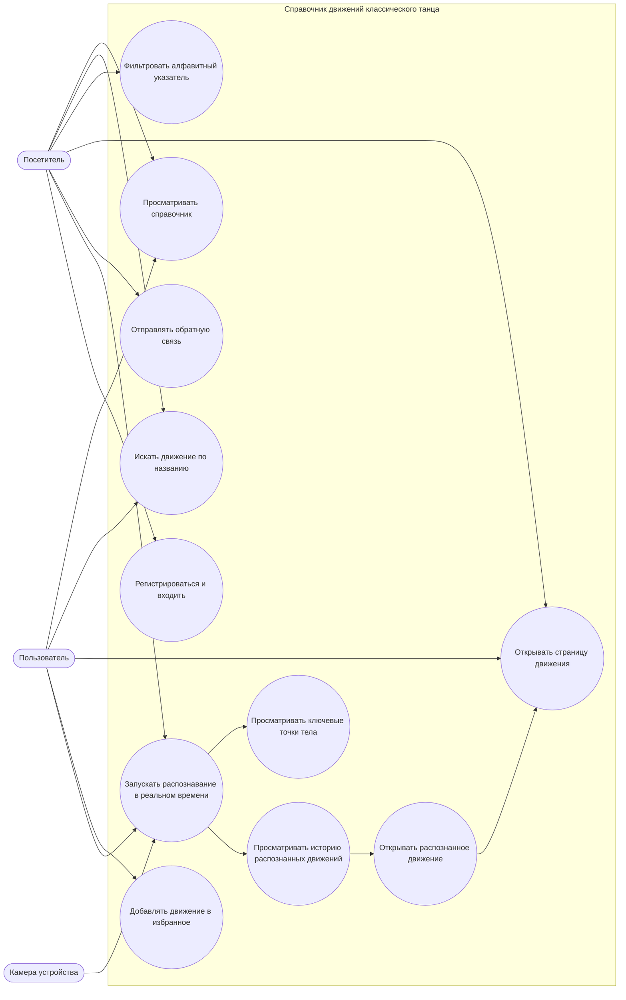
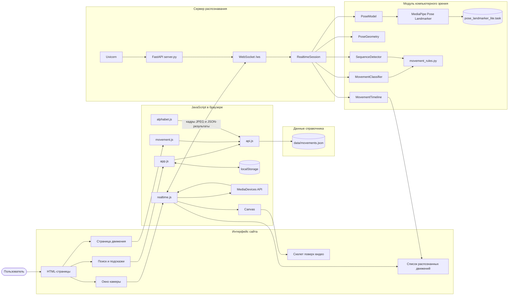
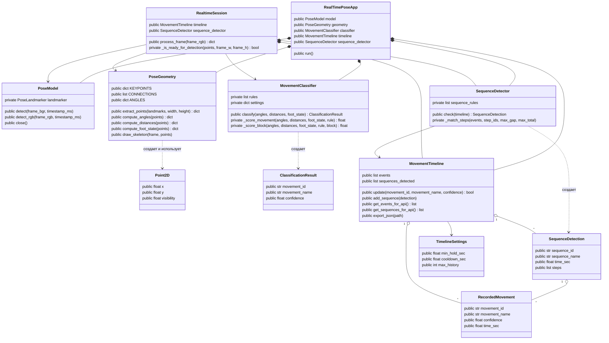
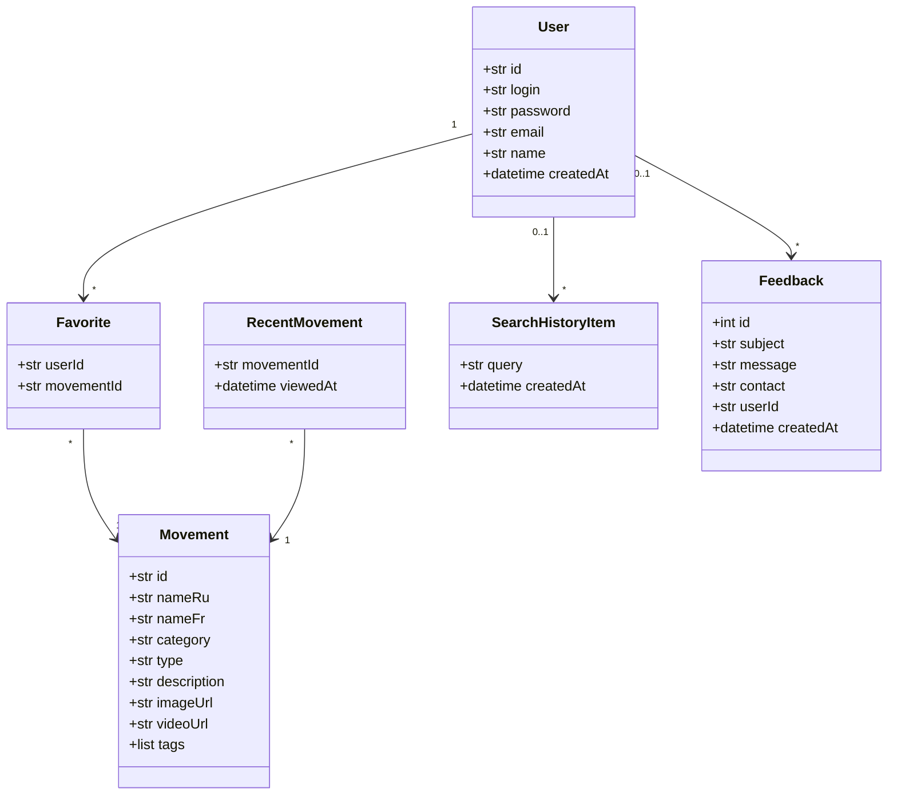
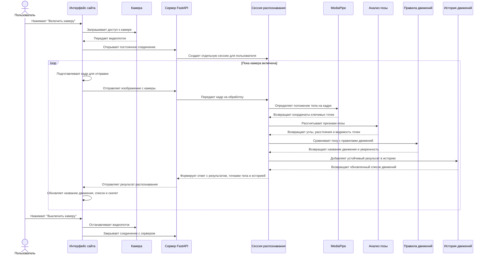
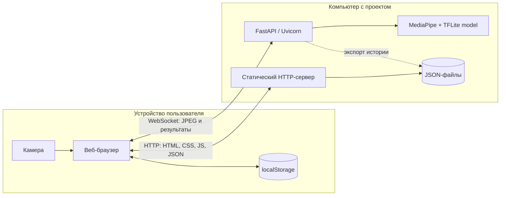

# UML-диаграммы проекта

Проект представляет собой веб-справочник движений классического танца с
поиском по названию и распознаванием движений по изображению с камеры.

Документ описывает текущее состояние реализации:

- веб-интерфейс работает в браузере;
- справочник хранится в `data/movements.json`;
- пользовательские данные хранятся в `localStorage`;
- FastAPI-сервер обрабатывает кадры по WebSocket;
- MediaPipe определяет ключевые точки тела;
- правила из `movement_rules.py` классифицируют движения.

Диаграммы записаны в формате Mermaid. Их можно просмотреть в редакторе с
поддержкой Mermaid, на GitHub или вставить в
[Mermaid Live Editor](https://mermaid.live/) для экспорта в PNG или SVG.

## Диаграмма вариантов использования



## Компонентная архитектура



Архитектура разделена на клиентскую и серверную части. В браузере работает интерфейс сайта, поиск по справочнику и окно камеры. Данные о движениях загружаются из `data/movements.json`. Для режима реального времени JavaScript получает изображение с камеры и отправляет кадры на FastAPI-сервер через WebSocket. Сервер передает кадры в модуль распознавания, где MediaPipe определяет ключевые точки тела, геометрический модуль рассчитывает признаки позы, а классификатор сравнивает их с правилами движений. После этого результат возвращается в браузер и отображается рядом с камерой.

## UML-диаграмма классов распознавания



## Модель данных веб-приложения

Классы ниже являются логическими сущностями. На текущем этапе они хранятся
как JSON-объекты в файле или в `localStorage`.



## Диаграмма последовательности realtime-распознавания



## Диаграмма активности распознавания кадра

```mermaid
flowchart TD
    Start([Получен кадр]) --> Decode[Декодировать JPEG]
    Decode --> Detect[MediaPipe определяет позу]
    Detect --> PoseFound{Поза найдена?}

    PoseFound -- Нет --> Unknown[Вернуть "Не определено"]
    PoseFound -- Да --> Points[Извлечь ключевые точки]
    Points --> Features[Вычислить углы, расстояния и видимость]
    Features --> Compare[Сравнить признаки с правилами]
    Compare --> Score{Оценка выше порога?}
    Score -- Нет --> Unknown
    Score -- Да --> Movement[Сформировать результат движения]
    Movement --> Timeline[Обновить историю]
    Timeline --> Sequence{Найдена последовательность?}
    Sequence -- Да --> SaveSequence[Добавить последовательность]
    Sequence -- Нет --> Response
    SaveSequence --> Response[Сформировать JSON-ответ]
    Unknown --> Response
    Response --> End([Отправить результат браузеру])
```

## Диаграмма развертывания



## Ответственность основных модулей

| Модуль | Ответственность |
|---|---|
| `server.py` | FastAPI-приложение, WebSocket, декодирование кадров |
| `pose_realtime.py` | MediaPipe, геометрия позы, классификация и realtime-сессия |
| `movement_rules.py` | Правила отдельных движений и последовательностей |
| `movement_timeline.py` | История распознанных движений и поиск последовательностей |
| `scripts/realtime.js` | Камера, отправка кадров, вывод результата и скелета |
| `scripts/app.js` | Общая логика интерфейса и поиск по названию |
| `scripts/api.js` | Загрузка справочника и операции с локальными данными |
| `scripts/alphabet.js` | Фильтрация и вывод алфавитного указателя |
| `scripts/movement.js` | Вывод страницы выбранного движения |
| `data/movements.json` | Справочник движений |

## Важное архитектурное замечание

В текущей учебной версии регистрация, избранное, история и обратная связь
хранятся в `localStorage`. Это не серверная база данных: данные доступны
только в конкретном браузере и могут быть удалены пользователем.

Для полноценной многопользовательской версии логично добавить серверную БД,
хеширование паролей и HTTP API для пользователей, избранного и обратной связи.
